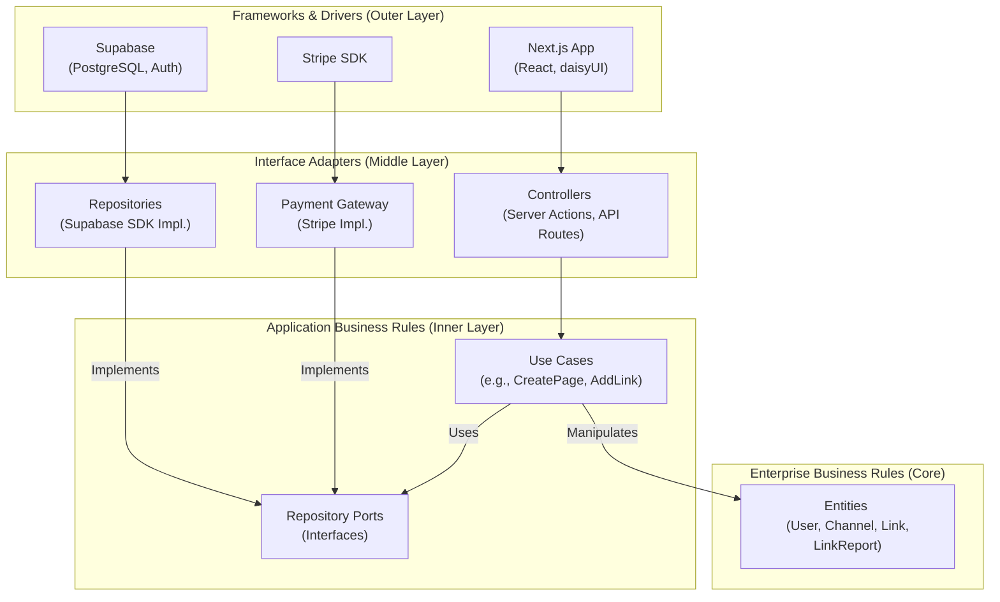

# Architecture Plan

This document provides a high-level overview of the proposed architecture and technology stack for the LinkDir project. It is based on the principles of **Clean Architecture**.

## 1. Guiding Principles

*   **Framework Independent:** The core business logic and use cases are not dependent on Next.js or any other framework.
*   **Database Agnostic:** The core is decoupled from the database (PostgreSQL) through a repository pattern. This allows the database to be swapped with minimal changes to the business logic.
*   **Testable:** Business rules can be tested without the UI, database, or any external element.
*   **Dependency Rule:** Source code dependencies can only point inwards. Nothing in an inner circle can know anything at all about something in an outer circle.

## 2. Clean Architecture Layers



*   **Entities:** Represent the core business objects (e.g., `User`, `Channel`, `Link`, `LinkReport`). They are plain objects with no knowledge of how they are stored or presented.
*   **Use Cases (Interactors):** Contain the application-specific business logic. They orchestrate the flow of data between entities and the outer layers (e.g., `CreateChannelUseCase`, `ReportLinkUseCase`).
*   **Interface Adapters:** Convert data between the format most convenient for the use cases and the format most convenient for external agencies. This layer includes **Repositories** and **Controllers/Presenters**.
*   **Frameworks & Drivers:** The outermost layer, composed of frameworks and tools like Next.js, PostgreSQL, and Stripe. This layer is volatile and the goal is to keep it as a "plugin" to the core application. This includes public-facing pages like the user's promo channel (`/{slug}`) and the link detail page (`/{slug}/link/{link_id}`).

## 3. Technology Stack

The technology stack is specifically chosen for a modern, scalable, and developer-friendly experience.

| Component              | Technology                                                                | Layer                | Justification                                                                      |
|------------------------|---------------------------------------------------------------------------|----------------------|------------------------------------------------------------------------------------|
| **Web Framework**      | [**Next.js 15.4.5**](https://nextjs.org/)                                   | Frameworks & Drivers | React 19 support, Server Actions, and latest performance optimizations.            |
| **UI Library**         | [**React 19**](https://react.dev/)                                          | Frameworks & Drivers | Core of Next.js, with new features like the `use` hook and Actions.                |
| **Component Library**  | [**daisyUI**](https://daisyui.com/)                                         | Frameworks & Drivers | Semantic component classes for Tailwind CSS with built-in themes and accessibility.|
| **Styling**            | [**Tailwind CSS v4**](https://tailwindcss.com/blog/tailwindcss-v4-alpha)    | Frameworks & Drivers | Utility-first CSS for rapid UI development with a new, faster engine.              |
| **Backend-as-a-Service** | [**Supabase**](https://supabase.com/)                                       | Frameworks & Drivers | Provides PostgreSQL database, authentication, and object storage in one platform.  |
| **Database**           | [**PostgreSQL**](https://www.postgresql.org/) (via Supabase)                | Frameworks & Drivers | Robust, open-source relational database.                                           |
| **Data Access**        | **[Supabase SDK](https://supabase.com/docs/library/js/getting-started)**    | Interface Adapters   | Initial implementation for data access, abstracted via the Repository Pattern.     |
| **Payments**           | [**Stripe**](https://stripe.com/)                                           | Frameworks & Drivers | Industry standard for payment processing and subscriptions.                          |


## 4. Data Access Strategy

To ensure the data access logic is swappable (e.g., migrating from Supabase SDK to Prisma), we will strictly adhere to the **Repository Pattern**.

1.  **Port Definition (The "Contract"):** For each entity, we will define a repository interface (a "port") inside `src/core/application/ports`. This interface will declare data operations required by the use cases (e.g., `createUser`, `findPageBySlug`). The core application will only ever reference these interfaces, never the concrete implementation.

    *Example (`src/core/application/ports/IUserRepository.ts`):*
    ```typescript
    import { User } from '@/core/domain/entities/User';

    export interface IUserRepository {
      findById(id: string): Promise<User | null>;
      findByEmail(email: string): Promise<User | null>;
      create(user: User): Promise<User>;
    }
    ```

2.  **Concrete Implementation (The "Adapter"):** The actual data access logic using the Supabase SDK will be implemented in a class within the `src/infrastructure/data/supabase` directory. This class will implement the corresponding repository interface.

    *Example (`src/infrastructure/data/supabase/SupabaseUserRepository.ts`):*
    ```typescript
    import { IUserRepository } from '@/core/application/ports/IUserRepository';
    // ... imports

    export class SupabaseUserRepository implements IUserRepository {
      // ... Supabase client setup

      async findById(id: string): Promise<User | null> {
        // ... logic using Supabase SDK
      }
      // ... other methods
    }
    ```

3.  **Future Migration to Prisma:** If we decide to migrate to Prisma, we will:
    *   Create a new implementation class, `PrismaUserRepository`, in `src/infrastructure/data/prisma`.
    *   This new class will implement the exact same `IUserRepository` interface.
    *   Update the dependency injection container to provide the `PrismaUserRepository` instead of the `SupabaseUserRepository`.

This approach completely decouples our core business logic from the specific data access tool, fulfilling a key promise of Clean Architecture.

## 5. Click Tracking & Redirection Implementation

To handle click tracking for both direct clicks and QR codes, we will use a dedicated internal API route for redirection.

1.  **URL Structure:** All external links will be presented to the user through a unified, internal URL structure: `/redirect/{link_id}`.
2.  **User Interaction:** When a user clicks a link on a channel page or scans a QR code, they are sent to this internal endpoint.
3.  **API Route Logic:** The API route at `/redirect/[link_id]` will:
    a.  Accept the `link_id` as a parameter.
    b.  Increment the `clicks` count for the corresponding `Link` in the database.
    c.  Retrieve the original destination URL from the `Link` table.
    d.  Respond with a 308 (Permanent Redirect) status to the original destination URL.

This approach ensures that all outbound traffic is recorded before the user is forwarded to the external site, providing accurate analytics.

## 6. Database Schema

The detailed database schema is maintained in a separate document to keep this architecture overview concise.

**[➡️ View the full Database Schema](./DATABASE_SCHEMA.md)**